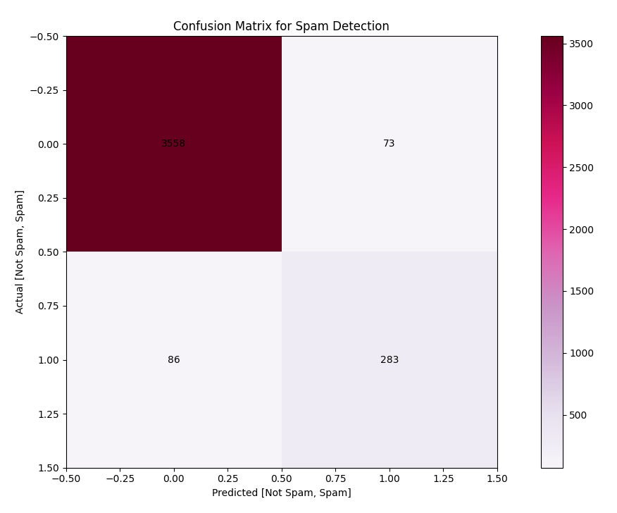

# 📧 Email Spam Detection using SVM  

This project implements a **Spam Email Classifier** using **Support Vector Machine (SVM)** with hyperparameter tuning via **RandomizedSearchCV**.  
The goal is to classify emails as **Spam** or **Not Spam** based on selected features.  

---

## 🚀 Features
- Preprocessing & feature scaling using `StandardScaler`  
- Support Vector Machine (SVM) with linear & RBF kernels  
- Hyperparameter tuning using `RandomizedSearchCV`  
- Model evaluation with Accuracy, Classification Report, and Confusion Matrix  
- Visualization of Confusion Matrix  

---

## 📂 Dataset
The dataset `spam_detection_dataset.csv` contains the following features:  

- `num_links` → Number of links in email  
- `num_words` → Total words in email  
- `has_offer` → Whether the email contains promotional offers  
- `sender_score` → Reputation score of the sender  
- `all_caps` → Whether the subject is written in ALL CAPS  
- `is_spam` → Target variable (0 = Not Spam, 1 = Spam)  

---

## ⚡ Installation
Clone the repository and install dependencies:  

git clone https://github.com/Wariha-Asim/Email Spam Classification using SVM..git
cd Email Spam Classification using SVM.PY

## 🧑‍💻 Model Training
Run the script to train and evaluate the model:  

python Email Spam Classification using SVM.py

## 🔍 Model Evaluation

- **Accuracy Score**  
- **Classification Report**  
- **Confusion Matrix**

## Confusion Matrix Visualization:  

## 🛠️ Technologies Used
- Python  
- Pandas, NumPy  
- Scikit-learn  
- Matplotlib  

## 📑 Example Output

Best Parameters from RandomizedSearchCV: {'C': 1.25, 'gamma': 'scale', 'kernel': 'linear'}

====================================================
Email Spam Classification Prediction Using SVM:  [0 1 0 0 1 0 0 1 1 0]

✅ Accuracy: 0.95

📑 Classification Report:
              precision    recall  f1-score   support
           0       0.96      0.95      0.95        90
           1       0.94      0.95      0.95        70
    accuracy                           0.95       160
   macro avg       0.95      0.95      0.95       160
weighted avg       0.95      0.95      0.95       160

## 📌 Project Structure

├── spam_detection_dataset.csv   # Dataset
├── Email Spam Classification using SVM.py  # Main code
├── confusion_matrix.png          # Confusion Matrix image
└── README.md                     # Documentation

Developed by **Waareha Asim** 👩‍💻  

